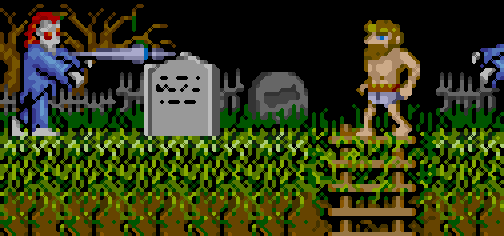

# ResizeX

_ResizeX_ is a Fast Image Resizer which can resize image with free size values or with fixed static values whereas the algorithms with static resizing values are faster that the general resizing algorithms. Some of the available algorithms, as for the ScaleXx, are adding also additional pixel information into the image.

#### Scale2x/Scale3x Examples

|Original size | |
|:----:|:----:|
|Double size (Scale2x) | |
|Triple size (Scale3x) | |

&nbsp;
&nbsp;
&nbsp;

## Available algorithm groups

|Algorithm|Description|
|:----:|:----:|
| ResizeX | Very fast picture resize with given factor by just cloning the pixels |
| ScaleX | Fast quality picture resize with given factor and a ScaleX algorithm adding details |
| FastResize | Resizes picture faster but probably with less details as the default .net Bitmap class scaler |
| ResizeNET | Resizes picture with the default .net Bitmap class scaler (Reference) |
| SharpResize | Resizes picture with more sharpness but slower as the default .net Bitmap class scaler |

Information about the Scale2X/Scale3X algorithm can be found at the [Scale2x homepage](https://www.scale2x.it/).

## Available algorithms

For every algorithm group are 8 algorithms available which scale to 200%, 300%, 400%, 600%, 800%, 900%, 1200% or 1600%.

_Remark:_ some image/scaler combinations may produce errors when images get to big in size/memory consumption!

## Library

All the image resizing functions are bundled in the _Feuster.Imaging.Resizing.Lib_

A Nuget package can be found in the project folder _Nuget_.

## Performance Test

The following tables show an example performance comparision of all scaler algorithms on a _Intel(R) Core(TM) i5-6500 CPU @ 3.20GHz_ whereas ResizeXXX is the default .net image scaler.
The performance test measures the pure conversion duration within a algorithm group without the time for file handling as loading or saving the image, so the results are independent of the type of storage where the image I/O is done.

### Reference Image

The following image is used as reference source for the performance test and can be found in the _Examples_ folder of the project.

### Performance Results
 #
##### __Resizing the reference picture to 300% size:__
| Resize2x | Scale2x | FastResize200 | Resize200 | SharpResize200 |
|:----:|:----:|:----:|:----:|:----:|
| 60ms | 73ms | 140ms | 143ms | 241ms |
 #
##### __Resizing the reference picture to 300% size:__

| Resize3x | Scale3x | FastResize300 | Resize300 | SharpResize300 |
|:----:|:----:|:----:|:----:|:----:|
| 52ms | 255ms | 290ms | 360ms | 918ms |
 #
##### __Resizing the reference picture to 400% size:__

| Resize4x | Scale4x | FastResize400 | Resize400 | SharpResize400 |
|:----:|:----:|:----:|:----:|:----:|
| 149ms | 325ms | 584ms | 600ms | 1172ms |
 #
##### __Resizing the reference picture to 600% size:__

| Resize6x | Scale6x | FastResize600 | Resize600 | SharpResize600 |
|:----:|:----:|:----:|:----:|:----:|
| 260ms | 852ms | 1265ms | 1357ms | 3806ms |
 #
##### __Resizing the reference picture to 800% size:__

| Resize8x | Scale8x | FastResize800 | Resize800 | SharpResize800 |
|:----:|:----:|:----:|:----:|:----:|
| 587ms | 1272ms | 2230ms | 2477ms | 4813ms |
 #
##### __Resizing the reference picture to 900% size:__

| Resize9x | Scale9x | FastResize900 | Resize900 | SharpResize900 |
|:----:|:----:|:----:|:----:|:----:|
| 548ms | 1748ms | 2778ms | 3061ms | 10115ms |
 #
##### __Resizing the reference picture to 1200% size:__

| Resize12x | Scale12x | FastResize1200 | Resize1200 | SharpResize1200 |
|:----:|:----:|:----:|:----:|:----:|
| 999ms | 2961ms | 4900ms | 5393ms | 16283ms |
 #
##### __Resizing the reference picture to 1600% size:__

| Resize16x | Scale16x | FastResize1600 | Resize1600 | SharpResize1600 |
|:----:|:----:|:----:|:----:|:----:|
| 2483ms | 4670ms | 8586ms | 9725ms | 19596ms |
 #

### __Conclusion:__

Overall the ResizeXx, ScaleXx and FastResizeXXX algorithms are faster than the reference ResizeXXX algorithm.
With the ResizeXx as fastest algorithm this can be easily up to 2 to 4 times faster than the reference ResizeXXX algorithm!

## Usage

ResizeX is a commandline tool which means it is controlled via commandline arguments within a shell or script.

For help on the available commandline arguments type:

`Resize.exe -h`

For help on the available algorithms type:

`Resize.exe -l`

A standard example for resizing a picture with a fixed scaler algorithm is:

`Resize.exe -i [path_to_input_image] -o [path_to_output_image] -s [scalertype]`

A standard example for resizing a picture with the FastResize scaler algorithm is:

`Resize.exe -i [path_to_input_image] -o [path_to_output_image] -f -x [new_width] -y [new_height]`

&nbsp;
&nbsp;
&nbsp;
# Copyright

© Alexander Feuster 2023

_ResizeX_ and _Feuster.Imaging.Resizing.Lib_ are licensed unter the [GNU GENERAL PUBLIC LICENSE Version 2](gpl-2.0.txt)
